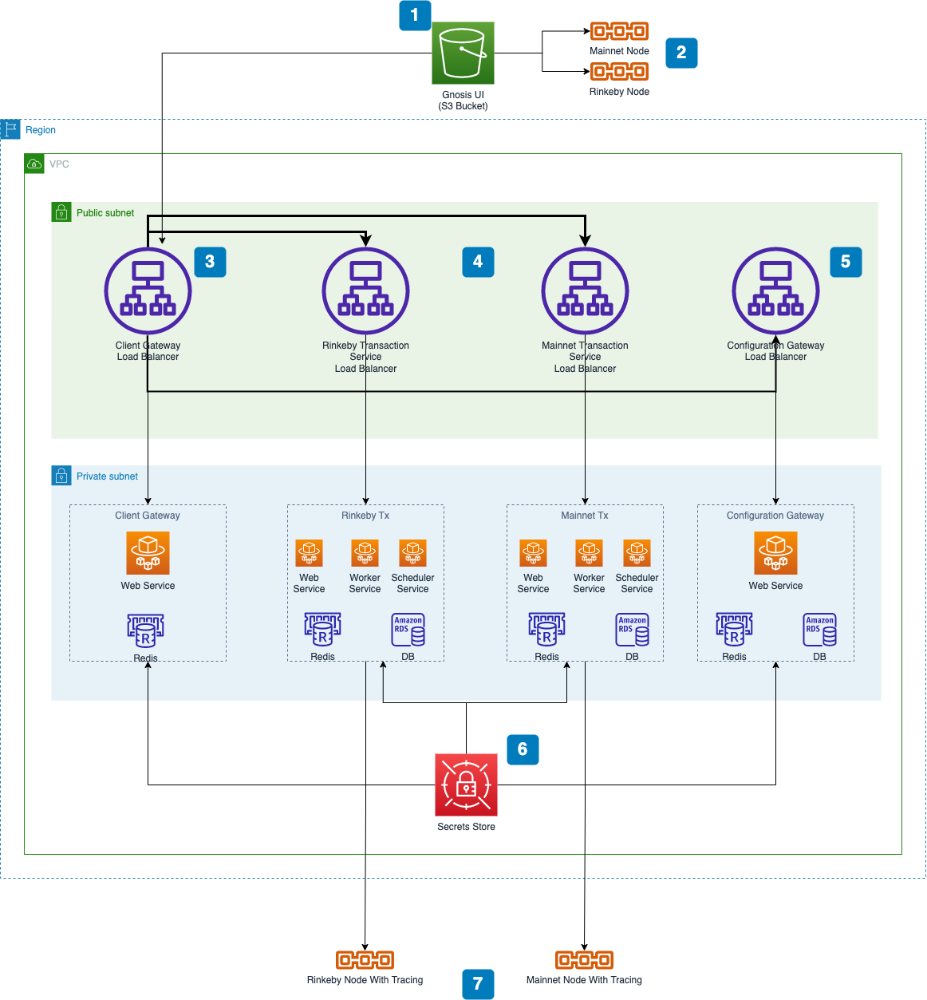

* [Welcome to Yearn Gnosis Safe!](#welcome-to-yearn-gnosis-safe)
   * [Setting up your local environment](#setting-up-your-local-environment)
   * [Infrastructure](#infrastructure)
   * [Deploying Gnosis Safe](#deploying-gnosis-safe)
      * [Prerequisites](#prerequisites)
      * [1. Create infrastructure for secrets and add secrets](#1-create-infrastructure-for-secrets-and-add-secrets)
      * [2. Build production bundle of the Gnosis Safe UI](#2-build-production-bundle-of-the-gnosis-safe-ui)
      * [3. Create the rest of the Gnosis Safe infrastructure (Client Gateway, Transaction Service, UI, Configuration Service)](#3-create-the-rest-of-the-gnosis-safe-infrastructure-client-gateway-transaction-service-ui-configuration-service)
      * [4. Index transaction data for existing safes](#4-index-transaction-data-for-existing-safes)
   * [Docker Containers](#docker-containers)
      * [Client Gateway](#client-gateway)
      * [Configuration Service](#configuration-service)
      * [Transactions Service](#transactions-service)
      * [Gnosis Safe UI](#gnosis-safe-ui)
   * [Ethereum Node](#ethereum-node)
      * [Deploying an Erigon Node](#deploying-an-erigon-node)
      * [Accessing your nodes](#accessing-your-nodes)
      * [Checking sync status](#checking-sync-status)
   * [Other things to consider](#other-things-to-consider)

# Welcome to Yearn Gnosis Safe!

This repository contains Infrastructure as Code (IaC) for a self-hosted version of
Gnosis Safe on AWS.

The infrastructure is defined using **[AWS Cloud Development Kit (AWS CDK)](https://aws.amazon.com/cdk/)**.
AWS CDK is an open source software development framework to define your cloud application resources using
familiar programming languages.

These definitions can then be synthesized to AWS CloudFormation Templates which can be deployed AWS.

## Setting up your local environment

Clone this repository.

It is best practice to use an isolated environment when working with this project.
To manually create a virtualenv virtual environment on MacOS and Linux:

```
$ python3 -m venv .venv
```

After the init process completes and the virtualenv is created, you can use the following step to activate your virtualenv.

```
$ source .venv/bin/activate
```

If you are a Windows platform, you would activate the virtualenv like this:

```
% .venv\Scripts\activate.bat
```

Once the virtualenv is activated, you can install the required dependencies.

```
$ pip install -r requirements.txt
$ pip install -r requirements-dev.txt
```

At this point you can now synthesize the CloudFormation template for this code.

```
$ cdk synth
```

## Infrastructure

The following diagram provides a high level overview of the infrastructure that this repository deploys:



[Source](https://drive.google.com/file/d/1gySv-RDkNYCQkVAr7eyniQx7Sl3N8j-7/view?usp=sharing)

1. The production bundle is deployed to an S3 bucket. You should be able to find the URL of the frontend UI by looking at the `Bucket website endpoint` in the `Static website hosting` section of the bucket's properties.
2. The frontend UI uses blockchain nodes to power some of the functionality. You can use a service such as Infura or Alchemy.
3. The UI performs most of its functionality by communicating with the Client Gateway.
4. The Client Gateway retrieves information about safes from the transaction service. There is a transaction service deployed for Mainnet and Rinkeby.
5. The Client Gateway also relies on the configuration service to determine which nodes and services to use for each network.
6. Secrets store stores credentials for all the different services.
7. The transaction service monitors Ethereum nodes for new blocks and inspects transactions with the `trace` API to index new safe related events. 


## Deploying Gnosis Safe

Deploying can be summarized in the following steps:

1. Create infrastructure for secrets and add secrets
2. Build production bundle of the Gnosis Safe UI
3. Create the rest of the Gnosis Safe infrastructure (Client Gateway, Transaction Service, UI, Configuration Service)
4. Index transaction data for existing safes

You can customize your deployment by specifying the following environment variables when running `cdk deploy`:

1. `CDK_DEPLOY_ACCOUNT` - The Account ID of the AWS account you want to deploy to.
2. `CDK_DEPLOY_REGION` - the AWS region you want to deploy to.
3. `UI_SUBDOMAIN` (*optional*) - Deploys the UI to a S3 bucket with the value of this environment variable. This is required if you want a [custom subdomain](https://docs.aws.amazon.com/Route53/latest/DeveloperGuide/RoutingToS3Bucket.html) for your UI.
4. `INCLUDE_RINKEBY` (*optional*) - If this `true`, CDK will deploy the transaction service to support the Rinkeby network.

### Prerequisites

Before you start you need to install **AWS CDK CLI** and bootstrap your AWS account:

1. [Prerequisites](https://docs.aws.amazon.com/cdk/latest/guide/getting_started.html#getting_started_prerequisites) 
2. [Install AWS CDK Locally](https://docs.aws.amazon.com/cdk/latest/guide/getting_started.html#getting_started_install)
3. [Bootstrapping](https://docs.aws.amazon.com/cdk/latest/guide/getting_started.html#getting_started_bootstrap)

The infrastructure in this repository requires a VPC with at least one public subnet. If you don't have a VPC that meets this criteria or want to provision a new VPC for this project, you can follow the instructions [here](https://docs.aws.amazon.com/AmazonECS/latest/developerguide/create-public-private-vpc.html).

To install a self hosted version of Gnosis Safe, you'll also need the following:

1. An Ethereum *Mainnet* node with the [Openethereum trace api](https://openethereum.github.io/JSONRPC-trace-module)
2. An Ethereum *Rinkeby* node with the [Openethereum trace api](https://openethereum.github.io/JSONRPC-trace-module)
3. An [Infura API](https://infura.io/) key
4. An [Etherscan API](https://etherscan.io/apis) key
5. An [Eth Gas Station API](https://docs.ethgasstation.info/#how-to-obtain-an-api-key) key
6. An [Exchange Rate API](https://exchangeratesapi.io/) key

### 1. Create infrastructure for secrets and add secrets

Use the **AWS CDK CLI** to deploy the shared infrastructure including a Secrets Vault where all sensitive secrets will be stored:

```bash
$ UI_SUBDOMAIN="gnosis.yearn.finance" CDK_DEPLOY_ACCOUNT="111111111111" CDK_DEPLOY_REGION="us-east-1" cdk deploy GnosisSafeStack/GnosisShared --require-approval never
```

> `CDK_DEPLOY_ACCOUNT` and `CDK_DEPLOY_REGION` define the account and region you're deploying the infrastructure to respectively

The deployment should create a shared secrets vault for all your secrets as well 2 secrets vaults for Postgres database credentials: one for the *Rinkeby Transaction Service* and one for the *Mainnet Transaction Service*.

> You can distinguish the different vaults by inspecting their tags. The Shared Secrets vault will have a `aws:cloudformation:logical-id` that starts with `GnosisSharedSecrets`

> Mainnet Postgres database credentials secrets vault will have a `aws:cloudformation:logical-id` that starts with `GnosisSafeStackGnosisSharedMainnetTxDatabaseSecret`

> Rinkeby Postgres database credentials secrets vault will have a `aws:cloudformation:logical-id` that starts with `GnosisSafeStackGnosisSharedRinkebyTxDatabaseSecret`


Fill out the following credentials in the Shared Secrets vault:

  1. TX_DATABASE_URL_MAINNET - Use the Mainnet Postgres database credentials and create a URL using the following template: `postgres://postgres:<PASSWORD>@<URL>:5432/postgres`
  2. TX_ETHEREUM_TRACING_NODE_URL_MAINNET - An Ethereum Mainnet node URL that has access to the `trace` API
  3. TX_ETHEREUM_NODE_URL_MAINNET - An Ethereum Mainnet node URL. Can be the same as `TX_ETHEREUM_TRACING_NODE_URL_MAINNET`
  4. TX_DJANGO_SECRET_KEY_MAINNET - Generate randomly using `openssl rand -base64 18`
  5. TX_DATABASE_URL_RINKEBY - Use the Rinkeby Postgres database credentials and create a URL using the following template: `postgres://postgres:<PASSWORD>@<URL>:5432/postgres`
  6. TX_ETHEREUM_TRACING_NODE_URL_RINKEBY - An Ethereum Rinkeby node URL that has access to the `trace` API
  7. TX_ETHEREUM_NODE_URL_RINKEBY - An Ethereum Rinkeby node URL. Can be the same as `TX_ETHEREUM_TRACING_NODE_URL_RINKEBY`
  8. TX_DJANGO_SECRET_KEY_RINKEBY - Generate randomly using `openssl rand -base64 18`
  9. UI_REACT_APP_INFURA_TOKEN - An Infura API token to use in the Frontend UI
  10. UI_REACT_APP_SAFE_APPS_RPC_INFURA_TOKEN - An Infura API token that you want to use for RPC calls. Can be the same as `UI_REACT_APP_INFURA_TOKEN`.
  11. CFG_DJANGO_SUPERUSER_EMAIL - The email address for the superuser of the Configuration service
  12. CFG_DJANGO_SUPERUSER_PASSWORD - The password for the superuser of the Configuration service. Randomly generate using `openssl rand -base64 18`.
  13. CFG_DJANGO_SUPERUSER_USERNAME - The username for the superuser of the Configuration service
  14. CFG_SECRET_KEY - Generate randomly using `openssl rand -base64 18`
  15. CGW_EXCHANGE_API_KEY - Your Exchange Rate API key
  16. UI_REACT_APP_ETHERSCAN_API_KEY - Your Etherscan API key
  17. CGW_ROCKET_SECRET_KEY - Generate randomly using `date |md5 | head -c24; echo`
  18. UI_REACT_APP_ETHGASSTATION_API_KEY - Your Eth Gas Station API key
  19. CGW_WEBHOOK_TOKEN - Generate randomly using `date |md5 | head -c24; echo`
  20. password - Not used. Leave as is.

  ### 2. Build production bundle of the Gnosis Safe UI

The [Gnosis Safe UI](https://github.com/gnosis/safe-react) is part of this GitHub repo as a submodule in the `docker/ui/safe-react` folder. Ensure that the submodule has been initialized:

```bash
$ git submodule update --init --recursive
```

To build the production bundle of the Gnosis Safe UI, use the build script in the `docker/ui` directory:

```bash
$ cd docker/ui
$ ENVIRONMENT_NAME=production AWS_PROFILE="default" ./build.sh
$ ../..
```

You must provide the following environment variables:

* `ENVIRONMENT_NAME` - The [environment name](https://github.com/numan/yearn-gnosis-safe/blob/main/app.py#L14) that matches the environment name of the backend being deployed
* `AWS_PROFILE` - The name of the `AWS_PROFILE` where you can access the backend infrastructure that was deployed in the previous step. This is used to gather information like urls for the client gateway and the transaction service.
* `AWS_REGION` - The region where the backend region is deployed. Assumes `us-east-1` by default.

### 3. Create the rest of the Gnosis Safe infrastructure (Client Gateway, Transaction Service, UI, Configuration Service)

Deploy the rest of the Gnosis Safe infrastructure:

```bash
$ UI_SUBDOMAIN="gnosis.yearn.finance" CDK_DEPLOY_ACCOUNT="111111111111" CDK_DEPLOY_REGION="us-east-1" cdk deploy --all --require-approval never
```

### 4. Index transaction data for existing safes

Indexing happens automatically, however, it can take 12+ hours for indexing to catch up to the most recent transaction. Once indexing is complete, you should be able to add any existing safe. 

## Docker Containers

This project uses the official [Gnosis Safe Docker Images](https://hub.docker.com/u/gnosispm) as a base and applies some modifications to support a self-hosted version.

All customized Dockerfiles can be found in the `docker/` directory.

### Client Gateway

There are no modifications made to the original docker image.

### Configuration Service

Adds a new command to bootstrap the configuration service with configurations that replicate the configurations found on the official [Gnosis Safe Configuration Service](https://safe-config.gnosis.io/).

The bootstrap command is designed to run only if there are no existing configurations.

Also modifies the default container command run by the container to run the bootstrap command on initialization.

### Transactions Service

Installs a new CLI command `reindex_master_copies_with_retry` and a new Gnosis Safe indexer `retryable_index_service` that retries if a JSON RPC call fails during indexing. This was added to make indexing more reliable during initial bootstraping after a new install.

### Gnosis Safe UI

Contains a git submodule with the official [Gnosis Safe UI](https://github.com/gnosis/safe-react). It uses the official Gnosis Safe UI repository to build the production bundle.

Before building a production file, some of the original configuration files are replaced. The current official ui hard codes the url for the configuration and transaction services. The configuration files are replaced to point to the newly deployed configuration and transaction services.

Running `docker/ui/build.sh` will automatically replace the configuration files and build a production bundle.

The UI is the only component that isn't hosted in a docker container. It is hosted as a static website on S3.


## Ethereum Node

One of the requirements to successfully run the Gnosis Safe backend is access to an Ethereum node with the [Openethereum trace module](https://openethereum.github.io/JSONRPC-trace-module) enabled.

You can use hosted nodes such as [QuickNode](https://www.quicknode.com/) or [Alchemy](https://www.alchemy.com/). Erigon provides an equivalent implementation of [Openethereum trace module](https://openethereum.github.io/JSONRPC-trace-module).

The following sections will describe how deploy a self hosted Erigon node using AWS CDK.

### Deploying an Erigon Node

1. Clone/fork this repository
2. Using `erigon_app.py` as a template, define the nodes you would like to run. As an example, to run a mainnet and rinkeby node, you might want want something like this:

```python
#!/usr/bin/env python3
import os

from aws_cdk import core as cdk
from aws_cdk import aws_ec2 as ec2

from yearn_gnosis_safe.erigon_stack import ErigonEthereumStack

app = cdk.App()


class AppStack(cdk.Stack):
    def __init__(self, scope: cdk.Construct, id: str, **kwargs) -> None:
        super().__init__(scope, id, **kwargs)

        ## VPC passed in through environment variables
        vpc_id = os.environ.get("CDK_DEPLOY_VPC")

        # NOTE: Your Ethereum Nodes go here
        ## Your Rinkeby Node
        ErigonEthereumStack(
            self,
            "ErigonRinkebyStack",
            vpc=ec2.Vpc.from_lookup(self, "VPC", vpc_id=vpc_id),
            chain_name="rinkeby",
            instance_type=ec2.InstanceType("i3.large"),
            **kwargs
        )

        ## Your Mainnet Node
        ErigonEthereumStack(
            self,
            "ErigonMainnetStack",
            vpc=ec2.Vpc.from_lookup(self, "VPC", vpc_id=vpc_id),
            chain_name="mainnet",
            instance_type=ec2.InstanceType("i3.2xlarge"), # Note the bigger instance to accommodate more data for mainnet
            **kwargs
        )


environment = cdk.Environment(
    account=os.environ.get("CDK_DEPLOY_ACCOUNT", os.environ["CDK_DEFAULT_ACCOUNT"]),
    region=os.environ.get("CDK_DEPLOY_REGION", os.environ["CDK_DEFAULT_REGION"]),
)
app_stack = AppStack(app, "ErigonApp", env=environment)
cdk.Tags.of(app_stack).add("app", "Erigon Node")


app.synth()

```

3. Deploy using AWS CDK: `CDK_DEPLOY_VPC="vpc-11111111" CDK_DEPLOY_ACCOUNT="11111111111" CDK_DEPLOY_REGION="us-east-1" cdk deploy --app "python erigon_app.py" --all --require-approval never`


Once deployment has completed, it can take a while for your nodes to completely sync up:

- For `Rinkeby` if can take up to 24h for the node to completely sync up
- For `Mainnet` if can take 2-3 days for the node to completely sync up

To check the status of Gnosis data syncing process, ssh into one of the web containers of the transaction service (Mainnet or Rinkeby) using the AWS CLI:

```bash
$ aws ecs execute-command  \
    --region us-east-1 \
    --cluster GnosisSafeStackGnosisTxMainnet00505B13-GnosisSafeCluster27D40EB3-1M1NOijeJ84w \
    --task 3a485889cb324c4abf8ee63c111a112b \
    --container web \
    --command "/bin/bash" \
    --interactive
```

Once in the container, execute the Django shell:

```bash
$ python manage.py shell
```

And run the following code in the Django shell:

```bash
>>> from safe_transaction_service.history import models
>>> for m in models.SafeMasterCopy.objects.all():
...     print(m)
...
Address=0xd9Db270c1B5E3Bd161E8c8503c55cEABeE709552 - Initial-block-number=12504268 - Tx-block-number=13596589
Address=0x34CfAC646f301356fAa8B21e94227e3583Fe3F5F - Initial-block-number=9084503 - Tx-block-number=13602831
Address=0xAC6072986E985aaBE7804695EC2d8970Cf7541A2 - Initial-block-number=6569433 - Tx-block-number=13908746
Address=0x8942595A2dC5181Df0465AF0D7be08c8f23C93af - Initial-block-number=6766257 - Tx-block-number=13908936
Address=0xb6029EA3B2c51D09a50B53CA8012FeEB05bDa35A - Initial-block-number=7457553 - Tx-block-number=13909008
Address=0xaE32496491b53841efb51829d6f886387708F99B - Initial-block-number=8915728 - Tx-block-number=13909348
Address=0x6851D6fDFAfD08c0295C392436245E5bc78B0185 - Initial-block-number=10329734 - Tx-block-number=13989493
Address=0x3E5c63644E683549055b9Be8653de26E0B4CD36E - Initial-block-number=12504423 - Tx-block-number=13998286
```

Once all the `Tx-block-number`s are close to the latest block on the chain, the syncing process has completed. Overtime, the transaction service will continue to parse new blocks as it encounters them.

### Accessing your nodes

To access your nodes, navigate the **[Load Balancer Page](https://console.aws.amazon.com/ec2/v2/home?region=us-east-1#LoadBalancers:sort=loadBalancerName)** on the AWS console. Find the load balancer for the node you want to access (should be obvious based on the name of your stack).

Grab the DNS name for your load balancer. This is the URL you'll use to access your nodes.

Alternatively, you can query all your load balancers using the AWS CLI:

`aws elbv2 describe-load-balancers --query "LoadBalancers[].{ID:LoadBalancerArn,NAME:DNSName}"`


**NOTE:** The node will be accessible on port `8545`

Your Node URL should look something like:

`http://Erigo-Erigo-11111-11111111.us-east-1.elb.amazonaws.com:8545`

### Checking sync status

To check the status of your nodes syncing, you can use the JSON RPC API.

```bash
$ curl --data '{"method":"eth_syncing","params":[],"id":1,"jsonrpc":"2.0"}' -H "Content-Type: application/json" -X POST http://Erigo-Erigo-11111-11111111.us-east-1.elb.amazonaws.com:8545
```

Once the node has completely the syncing process, you should see something like:

```
{"jsonrpc":"2.0","id":1,"result":false}
```

## Other things to consider

If you're running your own [Erigon](https://github.com/ledgerwatch/erigon) node, you'll need to increase the number of transactions you're allowed to include in `trace_*` requests. You can do this by setting the `--trace.maxtraces` to a high value (like `10000`) when running `rpcdaemon`.

Example:

```bash
$ rpcdaemon \
   --private.api.addr 127.0.0.1:9090 \
   --http.addr 0.0.0.0 \
   --http.port 8545 \
   --http.vhosts * \
   --http.corsdomain * \
   --http.api eth,debug,net,trace,web3,erigon \
   --verbosity 3 \
   --trace.maxtraces 10000 \
   --rpc.batch.concurrency 6
```